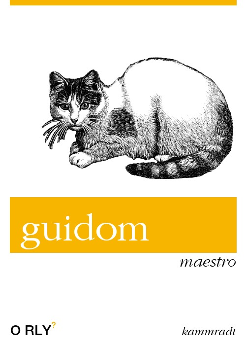

<h1 align="center">Welcome to the Guidom 🛡️</h1>

<p align="center">
  
</p>

> Just a study using Airflow for some automations

## Why ❓

> The idea is to use this project to study Airflow and related technologies.

## Documentation :pencil:
Currently, the project has two main automations:

- :rocket: [this one](https://github.com/C41949/guidom/blob/main/src/dags/twitter_good_morning_dag.py) that sends good morning messages with emojis on my [personal twitter account](https://twitter.com/kammzinho)

- :envelope:  [this one](https://github.com/C41949/guidom/blob/main/src/dags/twitter_dm_dag.pypy) that sends good morning direct messages with puppies to my friends


## Usage

```sh
make automate
```

## Author

👤 **Vinicius Kammradt**

* [Website](https://kammradt.now.sh)
* [Twitter](https://twitter.com/kammzinho)
* [Github](https://github.com/kammradt)
* [LinkedIn](https://linkedin.com/in/vinicius-kammradt)

## Show your support

Give a ⭐️ if this project helped you!

***
